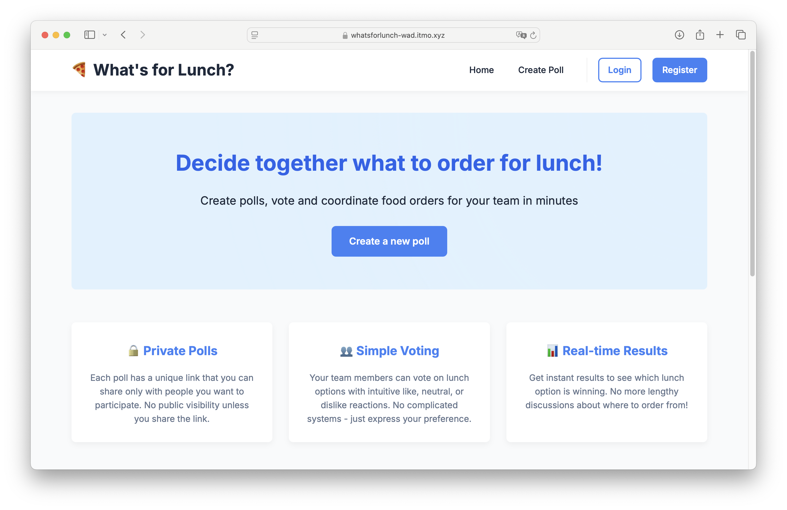

# 🍕 What's for Lunch?

A simple and intuitive web application for coordinating team lunch orders. Try it live at [whatsforlunch-wad.itmo.xyz](https://whatsforlunch-wad.itmo.xyz)!



## 📋 Overview

**Problem:** Coordinating lunch orders with colleagues is often chaotic and time-consuming. Teams waste time in chat discussions, struggle to reach consensus on menu choices, and often default to the same items due to decision fatigue.

**Solution:** A web-based lunch voting tool where team members can quickly vote on meal options within a set timeframe. The system helps teams make faster decisions about group lunch orders.

## ✨ Features

- **Simple poll creation**: create polls with multiple food options in seconds
- **Private sharing**: each poll has a unique link to share with your team
- **Intuitive voting**: like, neutral, or dislike reactions for each option
- **Real-time results**: view results as votes come in
- **Smart selection algorithm**: automatically calculates optimal food choices based on team preferences and restrictions
- **Timed decisions**: set deadlines for voting to ensure timely ordering
- **User accounts**: track and manage your polls (optional)

## 🚀 Getting Started

### Prerequisites

- Python 3.9 or higher
- pip (Python package manager)

### Installation

1. Clone the repository:
   ```
   git clone https://github.com/your-username/whats-for-lunch.git
   cd whats-for-lunch
   ```

2. Create and activate a virtual environment (optional, but recommended):
   ```
   python -m venv .venv
   
   # On Windows
   .venv\Scripts\activate
   
   # On macOS/Linux
   source .venv/bin/activate
   ```

3. Install required dependencies:
   ```
   pip install -r requirements.txt
   ```

4. Configure the environment variables by copying `.env.example` and renaming it to `.env`, then editing the required parameters as desired:

| Parameter | Description |
|-----------|-------------|
| `SECRET_KEY` | Your super secret key for Flask sessions and security |
| `DB_URI` | Database connection string (for example: sqlite:///lunch_app.db) |

5. Run the application:
   ```
   python app.py
   ```

6. Open your browser and navigate to:
   ```
   http://127.0.0.1:5000
   ```

## 💻 Usage

### Creating a Poll

1. Click "Create Poll" on the homepage
2. Enter a title, description, and optional deadline
3. Specify how many options should be selected in the final solution
4. Add food options with names and descriptions
5. Share the unique poll link with your team

### Voting

1. Open the poll link
2. Enter your name
3. Vote on each option (👍 Want, 😐 Neutral, 👎 Don't want)
4. Submit your vote
5. View results immediately

### Results

- View standard voting results showing likes, neutrals, and dislikes for each option
- When the poll closes (deadline reached or manually closed by creator), the system calculates the optimal food selection based on all preferences
- The algorithm balances food distribution equality and overall team satisfaction

## 🏗️ Project Structure

```
what's-for-lunch/
├── app.py                 # Main application entry point
├── extensions.py          # Flask extensions setup
├── models.py              # Database models
├── forms.py               # WTForms definitions
├── solution.py            # Optimal solution algorithm
├── routes/                # Route blueprints
│   ├── __init__.py
│   ├── auth_routes.py     # Authentication routes
│   ├── poll_routes.py     # Poll management routes
│   └── history_routes.py  # User history routes
├── static/                # Static assets
│   ├── style.css
│   └── script.js
├── templates/             # HTML templates
│   ├── base.html
│   ├── index.html
│   ├── history.html
│   ├── auth/
│   └── polls/
├── requirements.txt       # Project dependencies
├── .env.example           # Example environment variables
└── README.md              # This file
```

## 🛠️ Technologies Used

- **Backend**: Flask, SQLAlchemy, Flask-Login, WTForms
- **Frontend**: HTML5, CSS3, JavaScript
- **Database**: SQLite (configurable)
- **Algorithm**: Custom optimization algorithm for lunch selection

---

*Don't waste time deciding what to eat — use "What's for Lunch?" and get back to what matters!*